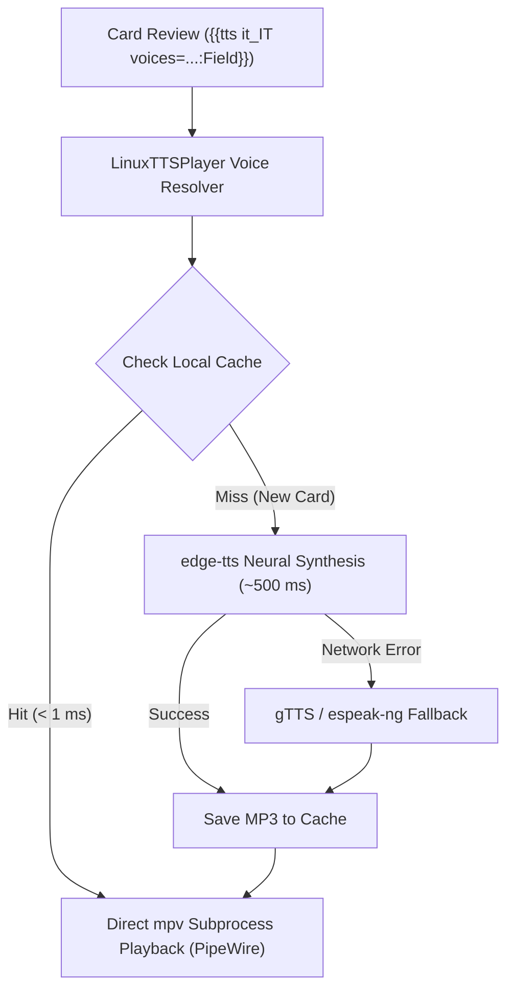

# Linux TTS Player for Anki (Edge Neural & Azure Speech)

[](https://www.gnu.org/licenses/agpl-3.0)
[](https://apps.ankiweb.net/)
[](#system-requirements)

Ultra-realistic Microsoft Azure / Edge Neural Text-to-Speech for Anki on Linux. Works seamlessly with native `{{tts}}` tags without requiring any API keys or paid subscriptions.

---

## The Problem

- **macOS** has the native `say` command built into Anki.
- **Windows** has native SAPI / Windows Media Speech built into Anki.
- **Linux has NO native TTS player in Anki.**

When you download shared decks or sync decks created on iOS, macOS, or Android, they frequently include tags like:
```html
{{tts it_IT voices=Apple_Federica_(Premium),com.google.android.tts-it-it-x-itb-local:ItalianWord}}
{{tts fr_FR voices=Apple_Audrey_(Premium),Microsoft_Vivienne:FrenchWord}}
```
On Linux, these tags either **fail completely into silence**, or fall back to robotic, metallic voices. Heavy add-ons often require setting up cloud API keys, monthly subscriptions, or complicated menus.

## The Solution

**Linux TTS Player** bridges this gap:
1. **Pristine Neural Voices**: Uses Microsoft's state-of-the-art Azure Speech / Edge Neural engines.
2. **Zero Setup & Zero Keys**: Works out-of-the-box with no Microsoft account, credit card, or API key needed.
3. **Universal Language & Tag Normalization**: Handles `it`, `it-IT`, `it_IT`, `ita` (ISO 639-1, 639-2/3, BCP 47).
4. **Transparent Voice Aliasing**: Automatically maps Apple (`Apple_*`), Android (`com.google.android.tts-*`), and Microsoft voices to their corresponding Azure Neural voices.
5. **Dynamic On-The-Fly Synthesis**: Whenever you review a brand-new card, audio is synthesized in ~500 ms and cached locally. Subsequent reviews play **instantly (<1 ms)**.
6. **Multi-Tier Resilience**: If you are ever offline without internet, it automatically falls back to standard Google Translate TTS or offline `espeak-ng`.
7. **Optimized for Modern Linux Audio**: Direct, low-latency playback via `mpv` integrated with PipeWire and PulseAudio, including volume compensation.

---

## Supported Languages & Voices

Includes **322 Microsoft Azure / Edge Neural voices across 142 locales** (all bundled offline in `voices.json`).

| Language | Default Neural Voice | Gender | Additional Included Voices |
| :--- | :--- | :--- | :--- |
| **Italian (`it_IT`)** | `it-IT-ElsaNeural` | Female | `it-IT-DiegoNeural` (M), `it-IT-IsabellaNeural` (F), `it-IT-GiuseppeMultilingualNeural` (M) |
| **French (`fr_FR`)** | `fr-FR-VivienneMultilingualNeural` | Female | `fr-FR-DeniseNeural` (F), `fr-FR-HenriNeural` (M), `fr-FR-EloiseNeural` (F), `fr-FR-RemyMultilingualNeural` (M) |
| **French Canada (`fr_CA`)** | `fr-CA-SylvieNeural` | Female | `fr-CA-JeanNeural` (M), `fr-CA-AntoineNeural` (M), `fr-CA-ThierryNeural` (M) |
| **English US (`en_US`)** | `en-US-JennyNeural` | Female | `en-US-GuyNeural` (M), `en-US-AriaNeural` (F) |
| **English UK (`en_GB`)** | `en-GB-SoniaNeural` | Female | `en-GB-RyanNeural` (M) |
| **German (`de_DE`)** | `de-DE-KatjaNeural` | Female | `de-DE-ConradNeural` (M) |
| **Spanish Spain (`es_ES`)** | `es-ES-ElviraNeural` | Female | `es-ES-AlvaroNeural` (M) |
| **Spanish Mexico (`es_MX`)** | `es-MX-DaliaNeural` | Female | `es-MX-JorgeNeural` (M) |
| **Russian (`ru_RU`)** | `ru-RU-SvetlanaNeural` | Female | `ru-RU-DmitryNeural` (M) |
| **Japanese (`ja_JP`)** | `ja-JP-NanamiNeural` | Female | `ja-JP-KeitaNeural` (M) |
| **Portuguese (`pt_BR`)** | `pt-BR-FranciscaNeural` | Female | `pt-BR-AntonioNeural` (M) |
| **Chinese (`zh_CN`)** | `zh-CN-XiaoxiaoNeural` | Female | `zh-CN-YunxiNeural` (M) |

*All standard languages supported by gTTS and espeak-ng are also supported as automatic fallbacks.*

---

## Installation

### System Prerequisites

Make sure `mpv` is installed on your Linux distribution:
- **Arch Linux / Omarchy**: `sudo pacman -S mpv`
- **Ubuntu / Debian**: `sudo apt install mpv`
- **Fedora**: `sudo dnf install mpv`

*(Optional)* For offline fallback: `sudo pacman -S espeak-ng` or `sudo apt install espeak-ng`.

### Option A: Install via `.ankiaddon` File (Recommended)

1. Download the latest `linux_tts_player.ankiaddon` from the [Releases](https://github.com/argrig666/anki-linux-tts-player/releases) page.
2. In Anki, go to **Tools** → **Add-ons** → **Install from file...**
3. Select `linux_tts_player.ankiaddon` and restart Anki.

### Option B: Install via Git / Manual Clone

1. Open a terminal and navigate to your Anki add-ons directory:
   ```bash
   cd ~/.local/share/Anki2/addons21/
   ```
2. Clone this repository directly into `linux_tts_player`:
   ```bash
   git clone https://github.com/argrig666/anki-linux-tts-player.git linux_tts_player
   ```
3. Restart Anki.

---

## Configuration

In Anki, navigate to **Tools** → **Add-ons** → select **Linux TTS Player (Edge Neural & Azure Speech)** → click **Config**.

```json
{
  "default_voices": {
    "it_IT": "it-IT-ElsaNeural",
    "fr_FR": "fr-FR-VivienneMultilingualNeural",
    "en_US": "en-US-JennyNeural"
  },
  "volume": 140,
  "audio_output": "pipewire,pulse",
  "debug_log": false
}
```

- **`default_voices`**: Choose your preferred voice for any language when a card template uses general tags like `{{tts it_IT:Word}}`.
- **`volume`**: Adjust software playback gain (default: `140`%).
- **`audio_output`**: Set mpv audio driver (default: `"pipewire,pulse"`).
- **`debug_log`**: Set to `true` to log synthesis events to `user_files/debug.log`.

---

## Architecture & How It Works



---

## License

GNU Affero General Public License v3.0 (AGPL-3.0). See [LICENSE](LICENSE) for details.
Includes dependencies under `vendor/` according to their respective open-source licenses.
